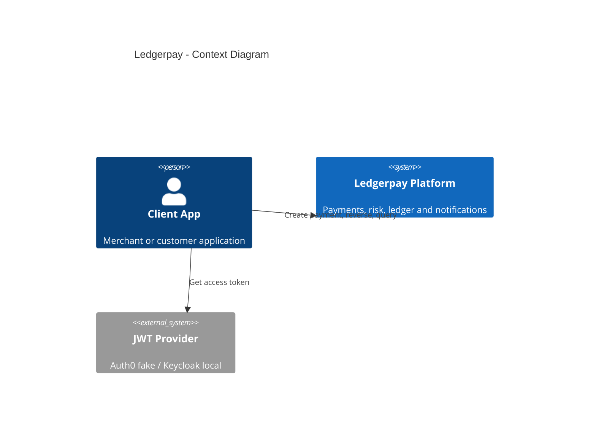
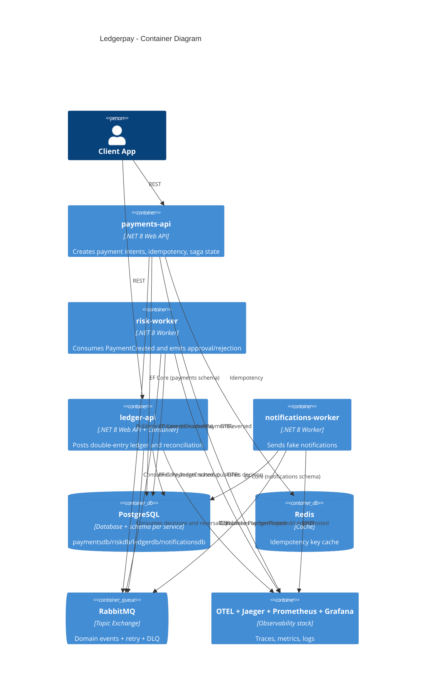

# C4 Context

```mermaid
C4Context
    title Ledgerpay - Context Diagram

    Person(client, "Client App", "Merchant or customer application")
    System(ledgerpay, "Ledgerpay Platform", "Payments, risk, ledger and notifications")
    System_Ext(auth, "JWT Provider", "Auth0 fake / Keycloak local")

    Rel(client, ledgerpay, "Create payment, reverse, query")
    Rel(client, auth, "Get access token")
```

# C4 Container

```mermaid
C4Container
    title Ledgerpay - Container Diagram

    Person(client, "Client App")

    Container(payments, "payments-api", ".NET 8 Web API", "Creates payment intents, idempotency, saga state")
    Container(risk, "risk-worker", ".NET 8 Worker", "Consumes PaymentCreated and emits approval/rejection")
    Container(ledger, "ledger-api", ".NET 8 Web API + Consumer", "Posts double-entry ledger and reconciliation")
    Container(notifications, "notifications-worker", ".NET 8 Worker", "Sends fake notifications")

    ContainerDb(pg, "PostgreSQL", "Database + schema per service", "paymentsdb/riskdb/ledgerdb/notificationsdb")
    ContainerDb(redis, "Redis", "Cache", "Idempotency key cache")
    ContainerQueue(rabbit, "RabbitMQ", "Topic Exchange", "Domain events + retry + DLQ")

    Container(obs, "OTEL + Jaeger + Prometheus + Grafana", "Observability stack", "Traces, metrics, logs")

    Rel(client, payments, "REST")
    Rel(client, ledger, "REST")

    Rel(payments, rabbit, "Publishes PaymentCreated/PaymentReversed")
    Rel(risk, rabbit, "Consumes PaymentCreated, publishes decision")
    Rel(ledger, rabbit, "Consumes decisions and reversals, publishes LedgerPosted")
    Rel(notifications, rabbit, "Consumes PaymentRejected/LedgerPosted")

    Rel(payments, pg, "EF Core (payments schema)")
    Rel(risk, pg, "EF Core (risk schema)")
    Rel(ledger, pg, "EF Core (ledger schema)")
    Rel(notifications, pg, "EF Core (notifications schema)")

    Rel(payments, redis, "Idempotency")

    Rel(payments, obs, "OTEL")
    Rel(risk, obs, "OTEL")
    Rel(ledger, obs, "OTEL")
    Rel(notifications, obs, "OTEL")
```
